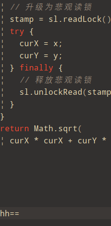

# 读多写少·读写互斥·本地缓存

前面我们介绍了管程和信号量这两个同步原语在 Java 语言中的实现，理论上用这两个同步原语中任何一个都可以解决所有的并发问题。那 Java SDK 并发包里为什么还有很多其他的工具类呢？原因很简单：**分场景优化性能，提升易用性**。

今天我们就介绍一种非常普遍的并发场景：**读多写少场景**。实际工作中，为了优化性能，我们经常会使用缓存，例如缓存元数据、缓存基础数据等，这就是一种典型的读多写少应用场景。缓存之所以能提升性能，一个重要的条件就是缓存的数据一定是读多写少的，例如元数据和基础数据基本上不会发生变化（写少），但是使用它们的地方却很多（读多）。


## ReadWriteLock

针对读多写少这种并发场景，Java SDK 并发包提供了读写锁——ReadWriteLock，非常容易使用，并且性能很好。

那什么是读写锁呢？

读写锁，并不是 Java 语言特有的，而是一个广为使用的通用技术，所有的读写锁都遵守以下三条基本原则：

1. 允许多个线程同时读共享变量；
2. 只允许一个线程写共享变量；
3. 如果一个写线程正在执行写操作，此时禁止读线程读共享变量。


读写锁与互斥锁的一个重要区别就是读写锁允许多个线程同时读共享变量，而互斥锁是不允许的，这是读写锁在读多写少场景下性能优于互斥锁的关键。但读写锁的写操作是互斥的，当一个线程在写共享变量的时候，是不允许其他线程执行写操作和读操作。


1. 允许多个读锁（可重入锁），多个读不互斥
2. 多个写互斥
3. 写和多个读之间也互斥

其实线程安全的缓存可以使用`Google-Guava`

下面我们自己动手实现一个本地缓存


```java

import java.util.HashMap;
import java.util.Map;
import java.util.Random;
import java.util.concurrent.locks.Lock;
import java.util.concurrent.locks.ReadWriteLock;
import java.util.concurrent.locks.ReentrantReadWriteLock;

public class Cache {
	
	final static Map<String, Object> map = new HashMap<>(); 
	
	final static ReadWriteLock rwLock = new ReentrantReadWriteLock();
	
	final static Lock rLock = rwLock.readLock();
	
	final static Lock wLock = rwLock.writeLock();
	
	static Object getIfPresent(String key) {
		
		rLock.lock();
		try {
			return map.get(key);
		} finally {
			rLock.unlock();
		}
		
	}
	
	static void put(String key, Object value) {
		wLock.lock();
		try {
			map.put(key, value);
		} finally {
			wLock.unlock();
		}
	}
	//实现缓存的按需加载·懒加载
	static Object get(String key) {
		Object v = null;
		rLock.lock();
		try {
			v = map.get(key);
		} finally {
			rLock.unlock();
		}
		if(null != v) {
			return v;
		}
		wLock.lock();
		try {
			// 再次验证
			// 其他线程可能已经查询过数据库,因为读线程不互斥
			v = map.get(key);
			if (v == null) {
				v = new Random().nextInt();//查询数据库
				map.put(key, v);
			} 
		} finally {
			wLock.lock();
		}
		
		return v;
	}


	
	

}

```

## StampedLock


StampedLock 支持的三种锁模式

我们先来看看在使用上 StampedLock 和上一篇文章讲的 ReadWriteLock 有哪些区别。

ReadWriteLock 支持两种模式：一种是读锁，一种是写锁。

> 1. 而 StampedLock支持三种模式，分别是：写锁、悲观读锁和乐观读。
> 2. 其中，写锁、悲观读锁的语义和 ReadWriteLock的写锁、读锁的语义非常类似，允许多个线程同时获取悲观读锁，但是只允许一个线程获取写锁，写锁和悲观读锁是互斥的。
> 3. 不同的是：StampedLock里的写锁和悲观读锁加锁成功之后，都会返回一个 stamp；然后解锁的时候，需要传入这个stamp。相关的示例代码如下。


代码演示写锁和悲观读锁，这个功能和上面的ReadWriteLock有异曲同工之妙

```java
package com.example.lua.demo;

import java.util.HashMap;
import java.util.Map;
import java.util.Random;
import java.util.concurrent.locks.StampedLock;

public class Cache {
	
	final static Map<String, Object> map = new HashMap<>(); 
	
	final static StampedLock sl = new StampedLock();
	
	static Object getIfPresent(String key) {
		
		long stamp = sl.readLock();
		try {
			return map.get(key);
		} finally {
			sl.unlockRead(stamp);
		}
		
	}
	
	static void put(String key, Object value) {
		long stamp = sl.writeLock();
		try {
			map.put(key, value);
		} finally {
			sl.unlockWrite(stamp);
		}
	}
	//实现缓存的按需加载·懒加载
	static Object get(String key) {
		Object v = null;
		long stamp = sl.readLock();
		try {
			v = map.get(key);
		} finally {
			sl.unlockRead(stamp);
		}
		if(null != v) {
			return v;
		}
		long stamp1 = sl.writeLock();
		try {
			// 再次验证
			// 其他线程可能已经查询过数据库,因为读线程不互斥
			v = map.get(key);
			if (v == null) {
				v = new Random().nextInt();//查询数据库
				map.put(key, v);
			} 
		} finally {
			sl.unlockWrite(stamp1);
		}
		
		return v;
	}


	
	

}
```


tampedLock 的性能之所以比 ReadWriteLock 还要好，其关键是 StampedLock 支持乐观读的方式。
ReadWriteLock 支持多个线程同时读，但是当多个线程同时读的时候，所有的写操作会被阻塞；
而 StampedLock 提供的乐观读，是允许一个线程获取写锁的，也就是说不是所有的写操作都被阻塞。

注意这里，我们用的是“乐观读”这个词，而不是“乐观读锁”，是要提醒你，乐观读这个操作是无锁的，所以相比较 ReadWriteLock 的读锁，乐观读的性能更好一些。


文中下面这段代码是出自 Java SDK 官方示例，并略做了修改。在 distanceFromOrigin() 这个方法中，首先通过调用 tryOptimisticRead() 获取了一个 stamp，这里的 tryOptimisticRead() 就是我们前面提到的乐观读。之后将共享变量 x 和 y 读入方法的局部变量中，不过需要注意的是，由于 tryOptimisticRead() 是无锁的，所以共享变量 x 和 y 读入方法局部变量时，x 和 y 有可能被其他线程修改了。因此最后读完之后，还需要再次验证一下是否存在写操作，这个验证操作是通过调用 validate(stamp) 来实现的。

```java
class Point {
  private int x, y;
  final StampedLock sl = 
    new StampedLock();
  // 计算到原点的距离  
  int distanceFromOrigin() {
    // 乐观读
    long stamp = sl.tryOptimisticRead();
    // 读入局部变量，
    // 读的过程数据可能被修改
    int curX = x, curY = y;
    // 判断执行读操作期间，
    // 是否存在写操作，如果存在，
    // 则 sl.validate 返回 false
    if (!sl.validate(stamp)){
      // 升级为悲观读锁
      stamp = sl.readLock();
      try {
        curX = x;
        curY = y;
      } finally {
        // 释放悲观读锁
        sl.unlockRead(stamp);
      }
    }
    return Math.sqrt(
      curX * curX + curY * curY);
  }
}

```

==hhhh==




